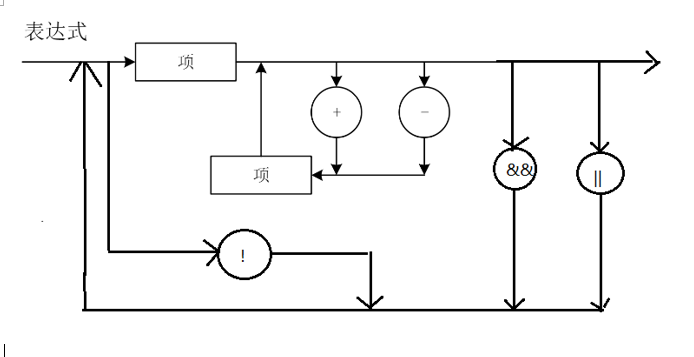
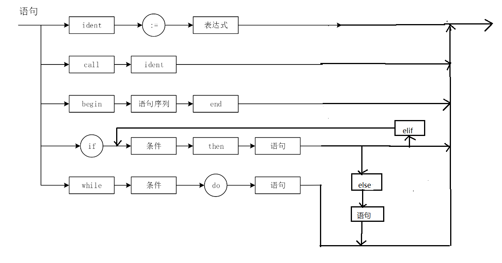

# 编译原理实验功能扩展实验报告
<h2>PB16111289 张家坤</h2>  
## 实验目的 
&emsp;1.完成语法分析中的错误处理      

&emsp;2.在lab3所给的拓展任务中，自行挑选数个任务完成，总计需要得到12颗⭐   
## 实验过程 
<h3>1.逻辑运算 </h3>

&emsp;在本次实验中，我负责的主要是逻辑运算的实现。
 
&emsp;首先对词法处理进行修改使之能识别逻辑运算符号，这个步骤比较简单。包括下面的增加ｅｌｓｅ、ｅｌｉｆ语句同样要对词法分析作一定的修改，使之能识别相应的ｔｏｋｅｎ。

&emsp;其次对上次语法分析中的语法图和产生式进行了修改，修改后的部分语法图如下:
    
&emsp;如上图所示，按照此语法图进行分析，相应的文法也需要进行修改，具体修改如下：    

> CO → ODD EX//修改前

> CO → EX R EX

> CO → NOT CO COZ//修改后

> CO → ODD EX COZ

> CO → EX R EX COZ				

> COZ → L CO COZ/e

> L → AND|OR


&emsp;condition中相关实现:
```c++
void condition(PL0Lex * lex) {
	//printf("analysis the condition expression\n");
	//逻辑运算!
    if(lex->last_token_type==TOKEN_NOT){
        PL0Lex_get_token_valid(S,lex);
        condition(lex);
    }
	else{
		if(lex->last_token_type==TOKEN_ODD){
			PL0Lex_get_token_valid(S,lex);
			expression(lex);
		}
		else{
			expression(lex);
			if(lex->last_token_type==TOKEN_EQU||lex->last_token_type==TOKEN_NEQ||
				lex->last_token_type==TOKEN_LES||lex->last_token_type==TOKEN_GTR||
				lex->last_token_type==TOKEN_LEQ||lex->last_token_type==TOKEN_GEQ){
					PL0Lex_get_token_valid(S,lex);
					expression(lex);
			}
			else
				printf("\n★  condition error\n");
		}
		//逻辑运算&&和||
    	if(lex->last_token_type==TOKEN_AND||lex->last_token_type==TOKEN_OR){
       		PL0Lex_get_token_valid(S,lex);
        	condition(lex);
    	}
	}
}
```
<h3>2.else/elif</h3>
&emsp;此外我还负责else/elif的加入：

&emsp;这部分的修改后的部分语法图如下:
    

&emsp;文法如下:
>ST → IF CO THEN ST EL

>EL → ESI|e

>ESI → ELSE THEN ST

>ESI → ELIF CO THEN ST EL

代码实现并不繁琐，这里略去不表。
  
<h3>3.遇到的问题  </h3>
&emsp;本次实验遇到的主要问题如下：  

&emsp;(1)产生式一开始没有考虑消除左递归，导致无限循环，利用重写文法就得到解决

&emsp;(2)值传递部分没有明白，小组讨论后无果，未能完成短路运算的部分


# 实验总结  
&emsp;本次实验中，我的任务是逻辑运算和else/elif实现。总的来说，更加深入的了解了文法的应用，对语法分析有了更深入的理解。


