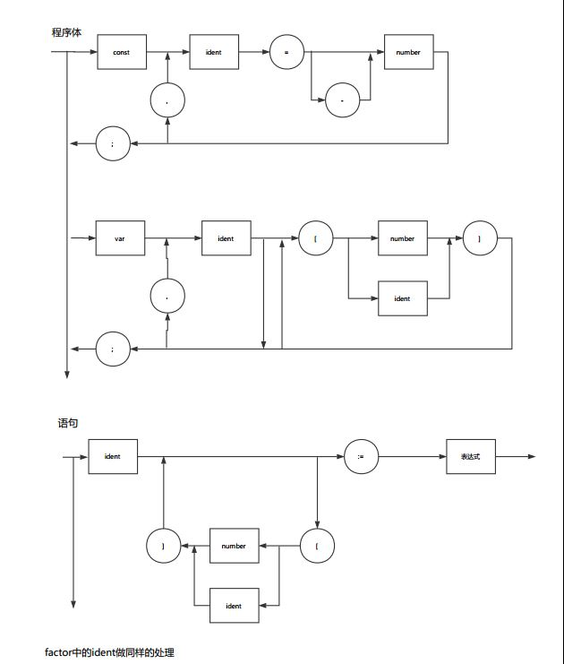

# 编译原理实验功能扩展实验报告  
## 实验目的 
&emsp;1.完成语法分析中的错误处理      
&emsp;2.在lab3所给的拓展任务中，自行挑选数个任务完成，总计需要得到12颗⭐   
## 实验过程 
1.实现过程概述  
&emsp;在本次实验中，我负责的是数组以及负数的处理。对数组的处理主要有以下工作：在词法分析加入对应符号，为PL/0语言加入数组变量声明/对数组元素赋值/在表达式中引用数组元素等。对负数的处理则较为简单，只需在原本有数字出现的地方增加一个对负号的处理即可，值得一提的是在表达式的分析中原本就是可以处理负数的，故表达式中的负数处理我没有做更改，仅在const声明和数组声明、引用中进行了处理。具体的实现细节如下。
  
2.具体实现  
&emsp;在实现过程中，我对上次语法分析中的语法图和产生式进行了修改，以使其能够正确处理数组和负数，修改后的部分语法图如下:(仅对我实现的进行修改)
    
&emsp;如上图所示，按照此语法图进行分析，即可在变量声明和表达式中使用数组，与之相对的，相应的语法也需要进行修改，使其能够进行正确的栈处理，修改的部分产生式如下：    
>M → var W SEMICOLON			//var声明   
>W → ident G F					    
>F → COMMA W| ε 	 							    
>G → [IDNU] G | &epsilon;		//处理数组  
>FA → IA | number | - EX |(EX)	//因子    
>IA → ident A                   //处理数组或者ID的非终结符  
>A → [IDNU] A| &epsilon;         //处理数组     
>NU → -number | number			//数字    
>IDNU → IA|NU   

&emsp;相应的实现代码：  
声明变量过程中数组声明处理：  
```c++
void var_declaration(PL0Lex * lex){
	char TokenStr[MAX_ID_LEN],ID[MAX_ID_LEN];
	int Dimension=0;														//dimension of the array
	int Enum[3];														    //element number of each dimension
	long position=lex->position;
	if(lex->last_token_type==TOKEN_IDENTIFIER){
		PL0Lex_get_token(lex);
		if(lex->last_token_type==TOKEN_LSBRACKETS){						   	//process array
			lex->position=position;

			PL0Lex_get_token_valid(S,lex);							   		//'['
			do{
				PL0Lex_get_token_valid(S,lex);								//num
				if(lex->last_token_type==TOKEN_MINUS){       //声明数组出现大小为负，需要报错
						PL0Lex_get_token_valid(S,lex);
						if(lex->last_token_type==TOKEN_NUMBER){
							printf("\n★  The size of array can't be negative\n");
						}
					}
				else if(!(lex->last_token_type==TOKEN_NUMBER||lex->last_token_type==TOKEN_IDENTIFIER)){
					printf("\n★  There must be a number or declared id in brackets\n");
				}
				else{
					Dimension++;
					if(lex->last_token_type==TOKEN_NUMBER)
						Enum[Dimension]=lex->last_num;
					else{ //利用声明过的const变量进行数组声明
						int i=LookupTable(lex->last_id);
						if(i==-1){//变量定义，需报错
							printf("\n★ The id is not declared\n");
							Enum[Dimension]=0;
						}
						else{//变量值为负，同样需要报错
							if(token_table[i].value<0){
								printf("\n★  The size of array can't be negative\n");
								Enum[Dimension]=0;
							}
							else//记录某维度的size
								Enum[Dimension]=token_table[i].value;
						}
					}
				}

				PL0Lex_get_token_valid(S,lex);
				if(lex->last_token_type!=TOKEN_RSBRACKETS){
					printf("\n★  Missing right square bracket\n");
				}
				PL0Lex_get_token_valid(S,lex);
			}while(lex->last_token_type==TOKEN_LSBRACKETS);
			int i,tablenum=1;												//we should allocate enough space for the array
			for(i=1;i<=Dimension;i++){//为数组开辟空间，此部分不完整，存在一些问题，等到下一个实验进行完善
				tablenum*=Enum[i];

			}
			for(i=0;i<tablenum;i++)
				table_append(lex,ID_VARIABLE);								//we won't change lex->last_id during previous process
		}
		else{
			lex->position=position;
			table_append(lex,ID_VARIABLE);									//unless we meet another id, or we won't change last_id, so here we can use lex without extra recovery
			PL0Lex_get_token_valid(S,lex);
		}
				
	}
	else
		printf("\n★  There must be an identifier to follow 'var'\n");

}
```
表达式因子中处理数组引用：  
```c++
void factor(){
if(lex->last_token_type==TOKEN_IDENTIFIER){
		if(LookupTable(lex->last_id)==-1)
			printf("\n★  %s is not defined\n",lex->last_id);
		PL0Lex_get_token_valid(S,lex);
		if(lex->last_token_type==TOKEN_LSBRACKETS){		//处理数组
			do{
				PL0Lex_get_token_valid(S,lex);
				if(lex->last_token_type==TOKEN_MINUS){//引用负地址，需要报错
						PL0Lex_get_token_valid(S,lex);
						if(lex->last_token_type==TOKEN_NUMBER){
							printf("\n★  The size of array can't be negative\n");
						}
					}
				if(lex->last_token_type!=TOKEN_NUMBER){	
					printf("\n★  There must be number between square brackets\n");
				}
				PL0Lex_get_token_valid(S,lex);
				if(lex->last_token_type!=TOKEN_RSBRACKETS){
					printf("\n★  Missing right square bracket\n");
				}
				PL0Lex_get_token_valid(S,lex);
			}while(lex->last_token_type==TOKEN_LSBRACKETS);
		}
	}
    ...
```	
const声明中负数的处理
```c++
void const_declaration(PL0Lex * lex) {
	char TokenStr[MAX_ID_LEN];
	if (lex->last_token_type == TOKEN_IDENTIFIER) {
		PL0Lex_get_token_valid(S,lex);
		if (lex->last_token_type == TOKEN_EQU || lex->last_token_type == TOKEN_BECOMES) {
			if (lex->last_token_type == TOKEN_BECOMES)
				printf("\n★  found ':=' when expecting '='\n");
			PL0Lex_get_token_valid(S,lex);
			if (lex->last_token_type==TOKEN_MINUS){//负数处理
				PL0Lex_get_token_valid(S,lex);
				if (lex->last_token_type == TOKEN_NUMBER) {
					lex->last_num=-lex->last_num;//取相反数后加入符号表
					table_append(lex, ID_CONSTANT);
					PL0Lex_get_token_valid(S,lex);			
				} else {
					printf("\n★  there must be a number to follow '='\n");
				}
			}			
			else if (lex->last_token_type == TOKEN_NUMBER) {
				table_append(lex, ID_CONSTANT);
				PL0Lex_get_token_valid(S,lex);				
			} else {
				printf("\n★  there must be a number to follow '='\n");
			}
		} else {
			printf("\n★  there must be an '=' to follow the identifier\n");
		}

	} else {

		printf("\n★  There must be an identifier to follow 'const'\n");

	}

}
```
  
3.主要问题  
&emsp;本次实验遇到的主要问题如下：  
&emsp;(1)对数组的处理：数组名和普通的变量名没有差别，但由于一开始没有意识到这一点，将数组与变量声明分离开来，导致文法发生归约-归约冲突，只是整个分析失败，在仔细分析后发现此问题，于是将变量声明和数组声明合并，解决了数组声明的问题    
&emsp;(2)对负数的处理：负数这一部分一开始感觉很不清晰，不知从何下手，刚开始考虑将负数的处理放在词法分析部分，因为这样不会破坏数字的整体性，但在尝试之后发现这种方法是不行的，因为要判断一个数是不是负数需要考虑上下文，若把负数处理放在词法分析部分则不符合上下文无关文法的定义，同时这样处理太过复杂，要实现它不太现实，于是将附属的分析放在了语法部分。而在语法分析处理负数时，刚开始想修改表达式中因子对数字的处理，但在尝试之后发现原来的表达式语法是可以分析负数的，在我修改之后反而会形成死循环从而分析出错，于是表达式的语法分析图无需改变。  
# 实验总结  
&emsp;本次实验中，我的任务是实现数组和负数的分析，在此过程中，我对语法分析有了进一步的理解，同时对整个分析过程也有了更清晰的认识。