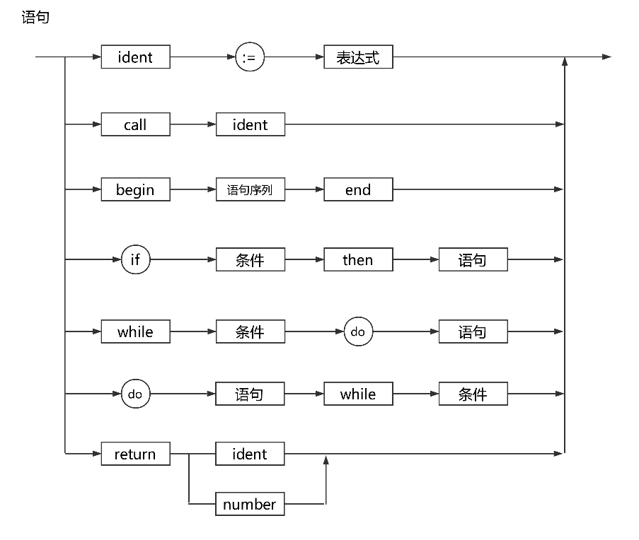

# <center>编译原理实验三</center>
## <center>——pl0语言的语法分析扩展</center>

--------------------------------------
> ### **实验目的**
>  - 学习使用Git进行多人项目合作
>  - 在实验二语法分析基础上进行扩展实现更多功能
>  - 撰写实验报告并阐明分工

-----------------------------------

> ### **实验工具**
>  - cmake version 3.5.1
>  - GNU Make 4.1
> - Clion by JetBrains

-----------------------------------

###  **实验过程**
  - <big>*错误处理主要思想*:</big>  &emsp;&emsp;实验二中完成了对pl0语言中产生式的设计和FIRST集合的构建，如果在进行语法分析的过程中出现了错误，大致分为词法错误和语法错误。在进行错误处理时，为了能够持续地处理错误而不是分析到一个错误就停止，采用了忽略错误的输入缓冲或弹出栈中的错误匹配项的方法，以此来暂时纠正错误使程序可以继续分析。以下分别对它们进行处理:
 > 1. **词法类型的错误**
 > - 变量未定义
 > ```
 > if(lex->last_token_type==TOKEN_IDENTIFIER){
		if(LookupTable(lex->last_id)==-1)
			printf("\n★  %s :An unrecognized character appears.\n",lex->last_id);
		PL0Lex_get_token_valid(S,lex);
> ```		
> - 变量以数字开始、数字过大
> ```
> while(!MatchDelimiter(lex->FileContent[i])){
				if(isalpha(lex->FileContent[i]))
					FlagForErrorId=1;
				i++;
				WordLen++;
			}
			if(FlagForErrorId)	{
				lex->last_token_type=TOKEN_NULL;
				printf("\n★  Wrong identifier format: identifier cannot start with a number.\n");
			}
			else if(WordLen>MAX_NUM_LEN){
				lex->last_token_type=TOKEN_NULL;
				printf("\n★  Too long identifier or number.\n");
			}
> ``` 
> - 段注释不匹配
> ```
> if(lex->FileContent[i]=='\0') {
						printf("\n★  Missing a end for comment: has reached the EOF.\n");
						return FALSE;
					}
> ``` 
> - 赋值号不完整
> ```
> else if(lex->FileContent[i]==':'){									
				i++;
				if(lex->FileContent[i]=='='){
					SymbolLen=2;
					ShiftForward(lex,SymbolLen);
					lex->last_token_type=TOKEN_BECOMES;
					return TRUE;
				}
				else{
					SymbolLen=1;
					ShiftForward(lex,SymbolLen);
					lex->last_token_type=TOKEN_NULL;
					printf("\n★  Expect an '=' after ':'\n");
					return TRUE;
				}
			}
> ```
> 2. **语法类型的错误**. 
> - 缺少';'或者','的错误(举一例)
> ```
> do {
				const_declaration(lex);
				while (lex->last_token_type == TOKEN_COMMA) {
					PL0Lex_get_token_valid(S,lex);
					const_declaration(lex);
				}
				if (lex->last_token_type == TOKEN_SEMICOLON) {
					PL0Lex_get_token_valid(S,lex);
				}
				else {
					printf("\n★  missing ',' or ';'\n");
				}
			} while (lex->last_token_type == TOKEN_IDENTIFIER);
> ```
> - 缺少右括号
> ```
> PL0Lex_get_token_valid(S,lex);
				if(lex->last_token_type!=TOKEN_RSBRACKETS){
					printf("\n★  Missing right square bracket\n");
				}
				PL0Lex_get_token_valid(S,lex);
> ```
> - const/var后缺少identifier等问题
> ```
> if (lex->last_token_type == TOKEN_IDENTIFIER) {
		PL0Lex_get_token_valid(S,lex);
		if (lex->last_token_type == TOKEN_EQU || lex->last_token_type == TOKEN_BECOMES) {
			if (lex->last_token_type == TOKEN_BECOMES)
				printf("\n★  found ':=' when expecting '='\n");
			PL0Lex_get_token_valid(S,lex);
			if (lex->last_token_type==TOKEN_MINUS){
				PL0Lex_get_token_valid(S,lex);
				if (lex->last_token_type == TOKEN_NUMBER) {
					lex->last_num=-lex->last_num;
					table_append(lex, ID_CONSTANT);
					PL0Lex_get_token_valid(S,lex);				
				} else {
					printf("\n★  there must be a number to follow '='\n");
				}
			}			
			else if (lex->last_token_type == TOKEN_NUMBER) {
				table_append(lex, ID_CONSTANT);
				PL0Lex_get_token_valid(S,lex);				
			} else {
				printf("\n★  there must be a number to follow '='\n");
			}
		} else {
			printf("\n★  there must be an '=' to follow the identifier\n");
		}
	} else {
		printf("\n★  There must be an identifier to follow 'const'\n");
	}
}
> ```
> - 赋值语句后缺少赋值号
> ```
> else{
				printf("\n★  There must be a ':=' following the id\n");
				PL0Lex_get_token_valid(S,lex);
			}
> ```
> - ‘=’后没有出现数字
> ```
> if (lex->last_token_type==TOKEN_MINUS){
				PL0Lex_get_token_valid(S,lex);
				if (lex->last_token_type == TOKEN_NUMBER) {
					lex->last_num=-lex->last_num;
					table_append(lex, ID_CONSTANT);
					PL0Lex_get_token_valid(S,lex);				
				} else {
					printf("\n★  there must be a number to follow '='\n");
				}
			}	
> ``` 
> - If 与 then 未匹配
> ```
> else if(lex->last_token_type==TOKEN_IF){
			PL0Lex_get_token_valid(S,lex);
			condition(lex);
			if(lex->last_token_type==TOKEN_THEN){
				statement(lex);
			}
			else{
				printf("\n★  Matching error:Expecting 'then'\n");
				lex->position-=lex->end-lex->begin+1;
				S->length++;
				S->top++;
				statement(lex);
			}
		}
> ```
> - While 与 do 未匹配
> ```
> else if(lex->last_token_type==TOKEN_WHILE){
			PL0Lex_get_token_valid(S,lex);
			condition(lex);
			if(lex->last_token_type==TOKEN_DO){
				statement(lex);
			}
			else{
				printf("\n★  Matching error:Expecting 'do'\n");
				lex->position-=lex->end-lex->begin+1;
				S->length++;
				S->top++;
				statement(lex);
			}
		}
> ```
> - 返回值类型错误
> ```
> else if(lex->last_token_type==TOKEN_RETURN){//返回值
			PL0Lex_get_token_valid(S,lex);
			if(lex->last_token_type==TOKEN_SEMICOLON){
				printf("\n★  Matching error:Expecting return value\n");
			}
			statement(lex);
			//保留val属性传递
		}
>```
>- 条件表达式错误
>```
> else{
			expression(lex);
			if(lex->last_token_type==TOKEN_EQU||lex->last_token_type==TOKEN_NEQ||
				lex->last_token_type==TOKEN_LES||lex->last_token_type==TOKEN_GTR||
				lex->last_token_type==TOKEN_LEQ||lex->last_token_type==TOKEN_GEQ){
					PL0Lex_get_token_valid(S,lex);
					expression(lex);
			}
			else
				printf("\n★  Wrong op in a binary conditional expression: could only use '=', '!=', '<', '>', '<=', '>='.\n");
		}6225752102672211
>```
> - 程序未结束或者缺少'.'
> ```
> if(lex->last_token_type!=TOKEN_PERIOD){
		if(!IsEmpty(S)&&strcmp(S->S[S->top-1],"PERIOD")!=0)
			printf("\n★  Your program is not completed, please finish it. Or you should check if your 'end' matches 'begin' correctly\n");
		else
			printf("\n★  There must be a '.' at the end of program\n");
	}
> ```
> - 非终结符匹配错误
>       - Wrong beginning of statement: could only use 'ident', 'call', 'begin', 'if', 'while'.
>       - Wrong beginning of procedure: could only use 'const', 'var', 'procdure', 'ident', 'call', 'begin', 'if', 'while'.
>       - Wrong beginning of condition: could only use 'odd', '=', '!=', '<', '>', '<=', '>='.

 - <big>*增添功能*:</big>

##### &emsp;&emsp;&emsp;&emsp;本次实验还要求在实验二语法分析的基础上增添更多丰富的功能，我在小组中负责return语句的分析以及增加do-while语句的分析。
>   1.  **写出相应增加的产生式**
>    ST → DO ST WHILE CO             //增加dowhile语句
>    ST → RETURN IDNU               //增加return语句
>   IDNU → IA|NU
>   2.  **在syntax.h的栈中添加产生式，并完善FIRST()集**  
>    const char ParserST6[Max_Parser_Len][MAX_ID_LEN]={"CO","WHILE","ST","DO","\0"};
>    const char ParserST7[Max_Parser_Len][MAX_ID_LEN]={"IDNU","RETURN","\0"};
>   3. 由于新增添的两个功能都属于语句的范畴，在statement中写出相应分析的代码
>```
>else if(lex->last_token_type==TOKEN_DO){
			statement(lex);
			if(lex->last_token_type==TOKEN_WHILE){
                PL0Lex_get_token_valid(S,lex);
				condition(lex);
			}
			else{
				printf("\n★  Matching error:Expecting 'while'\n");
				lex->position-=lex->end-lex->begin+1;
				S->length++;
				S->top++;
				condition(lex);
			}
		}
		else if(lex->last_token_type==TOKEN_RETURN){//返回值
			PL0Lex_get_token_valid(S,lex);
			if(lex->last_token_type==TOKEN_SEMICOLON){
				printf("\n★  Matching error:Expecting return value\n");
			}
			statement(lex);
			//保留val属性传递
		}
>```

### **实验总结**
> &emsp;1. 本次实验较好地完成了lab-3中需要实现的功能，在整个程序中最核心的处理错误的方法为:
>```
>GetTop(S,Stop);
		if(strcmp(Stop,c)==0){
			Pop(S,Stop);
			Print(S);
			return;
		}
		else if(IsTerminal(Stop)&&strcmp(Stop,c)!=0){
			//printf("\n★  error,the top of the stack doesn't match input, we will pop the terminal\n");
			Pop(S,Stop);
			Print(S);
		}
		else if(MatchParser(Stop,c,Parser)==FALSE){
			if(First(Stop,"e")&&Synch(Stop,c)){
				Pop(S,Stop);
				Push(S,"e");
				Print(S);
				Pop(S,Stop);
				Print(S);
			}
			else if(Synch(Stop,c)){
				//printf("\n★  Match error, we will ignore the nonterminal at the top of the stack\n");
				Pop(S,Stop);
				Print(S);
			}
			else{
				printf("\n★  error,you miss something,please check your grammar\n");
				return;
			}
>```
>*即在输入缓冲和栈顶元素不匹配时忽略缓冲区中的错误token或者弹出栈顶未能被匹配的项，并打印输出错误。*


> &emsp;2. 对第二项任务，增添pl0语法分析器的功能方面，我负责Return返回的部分和do-while语句的分析部分，
> 通过增加产生式，完善FIRST()集和语法图，写出相应的代码等方式顺利完成
> 最终实现的语法图: 
> 


## 小组的完成情况
> 在lab-3 中我们小组的分工如下：
> 1. 邱浩宸(PB16111424)负责错误处理的完善，Return和do-while语句的实现
> 2. 储召乐(PB16111294)负责数组的实现和负数的实现
> 3. 张家坤(PB16111424)负责调试程序、增加逻辑运算符以及增加else/elif的语句实现


